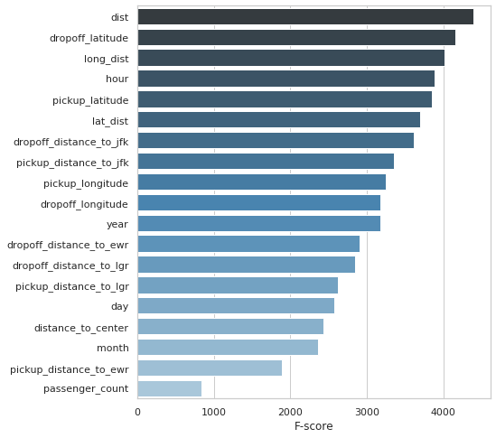

# Kaggle: New York City Taxi Fare Prediction ([link](https://www.kaggle.com/c/new-york-city-taxi-fare-prediction))

__Data__: 55 million taxi rides with location and date features 

__Task__: predict  the fare amount for a taxi ride in New York City

__Evaluation__: Root Mean Squared Error

__Solution__: XGBoost with Bayesian Optimization

__Success__: 3.084 RMSE

